# Athena Digital — Software Factory Architecture

Spec-driven, skill-composed, eval-gated: turns a feature spec into a reviewable, deployable PR across seven products. One organizing decision — every worker is the same model; only the harness differs. The conductor is deterministic code, the plan is an explicit artifact, nothing advances a stage without passing an eval.

Each `mermaid` block is independent (paste into mermaid.live, GitHub, or VS Code). Sections follow the spine: spec → codebase intelligence → orchestration → workers → verification → review → PR, with the learning loop feeding back.

---

## 1. Master system architecture

The spec-to-PR spine (solid), with codebase intelligence feeding context in and the learning loop feeding improvements back (dotted). Every node expands into its own section below.

**Autonomy ladder:** Athena sits at rung two — 94% tool adoption is pair-programming, which is exactly why cycle time is stuck at +11%. The factory moves the CRUD pattern to rung five: agents plan, build, verify, and assemble while humans stay on the gates. The trust ladder is that climb made incremental — a gate collapses only when a production metric earns it, never on a schedule.

**Build, don't buy or wait:** the model is a commodity by design, so the durable asset is the layer a vendor cannot own — the seven-repo convention and exemplar index, the golden set grown from Athena's own production failures, and the eval harness encoding what "correct at Athena" means. Vendors optimize the 22% (writing code); this targets the 78% (conventions, gates, compliance). Reversible: if a vendor ships orchestration, the specs, skills, and evals port onto it.

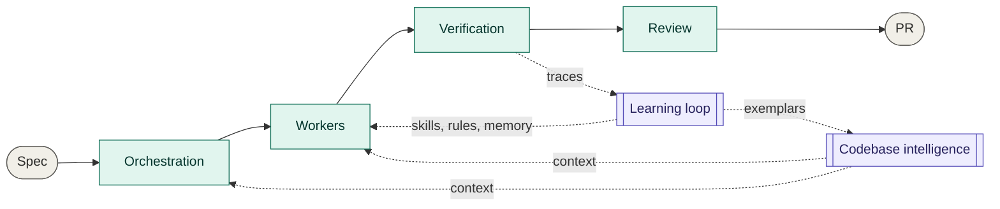

---

## 2. Spec authoring (source of truth)

The spec is the human's primary surface and the contract everything derives from. A brief plus a pattern template compiles to a typed spec; the validator gates it on completeness and consistency; a human approves it; the versioned spec is the audit trail everything traces to.

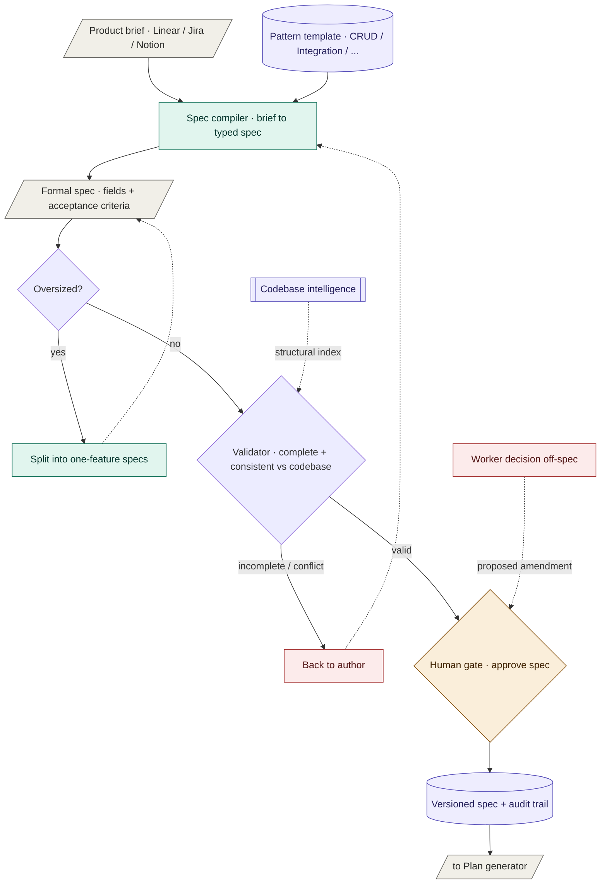

- **Compiler:** natural-language brief → typed, schema-validated spec (`product`, `pattern`, `entity`, `fields`, `permissions`, `audit`, `integrations`, `ui`).
- **Acceptance criteria (the keystone):** explicit, testable behavioral expectations, not just structural fields — so spec-derived tests come from intent, not entity shape, and change fail rate gets a precise per-spec definition (a failed change violates the spec's acceptance criteria in production).
- **Validator:** a linter gates compilation — missing acceptance criteria, underspecified fields, or a missing permission gate means no plan and no code.
- **Consistency gate (same validator):** also lints the spec against codebase intelligence's structural index, so a spec conflicting with what exists (duplicate entity/table, permission already defined) is caught at spec time — the cheap upstream half of brownfield impact analysis.
- **Templates per pattern:** CRUD / Integration / Workflow / Analytics each have a template the brief fills in — the spec-side analog of skills.
- **Versioning & traceability:** every spec is versioned; every generated file maps to a spec field and every eval to an acceptance criterion, so the generation report shows what produced what.
- **Owns the audit trail:** spec + traces + generation report is the compliance record for the SOC 2 and HIPAA products.
- **Amendment rule:** any worker decision not covered by the spec surfaces as a proposed amendment for human approval, so the spec never drifts from what ships.
- **Batch discipline:** one spec = one feature = one deployable PR; the compiler splits oversized specs — DORA's batch-size discipline enforced upstream of any code.

---

## 3. Codebase intelligence (one system, seven repos)

Learns each product's conventions so output reads as native. One indexer feeds four stores; hybrid retrieval serves them as context to the spine; two loops keep it fresh — re-index on merge, and exemplars graduated by the learning loop.

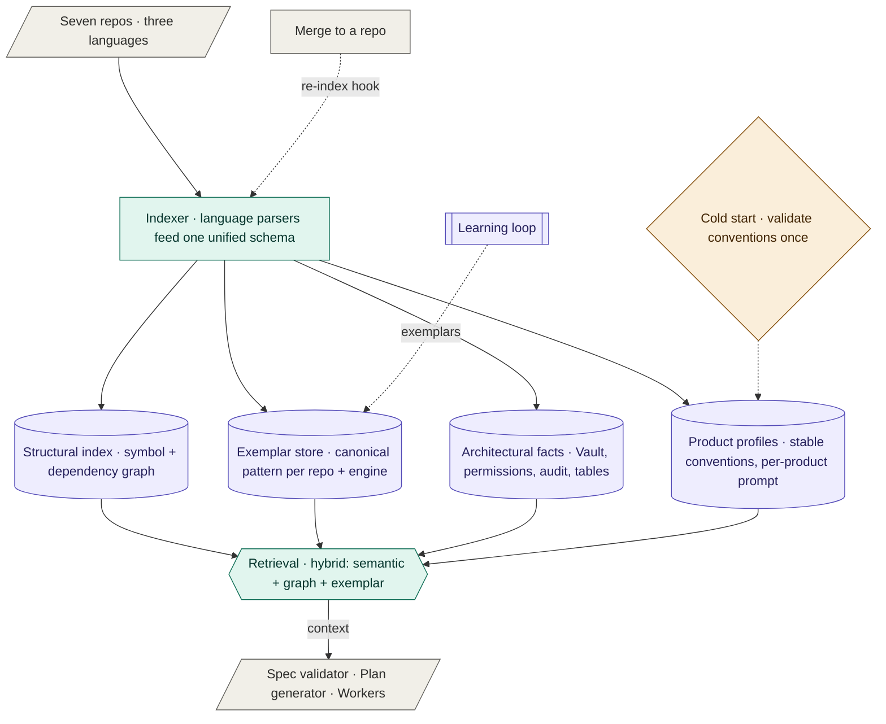

- **Indexer:** language-specific parsers feed one unified schema, so seven repos in three languages are one system.
- **Structural index:** symbol + dependency graph — answers "where does auth get checked," not just text similarity.
- **Exemplar store:** the canonical implementation of each pattern per repo, keyed by language and DB engine (Postgres, MongoDB, DynamoDB, Redis diverge most at migration/persistence, so there's one migration skill per engine). This is what makes output look like a teammate wrote it.
- **Architectural facts:** how this product does Vault, permissions, audit logging, table components, staging config.
- **Product profiles:** stable conventions baked into a per-product system prompt; volatile feature context retrieved at generation time.
- **Retrieval:** hybrid — semantic + structural graph + exemplar lookup.
- **Cold start:** index a repo, generate a conventions report, validate once with an engineer.
- **Freshness:** re-index on merge via a CI hook — a stale index is the likeliest silent cause of falling below the pass bar.

---

## 4. Orchestration

Deterministic conductor over an explicit plan — traceable where a multi-agent swarm is not. It compiles the spec into a dependency graph and walks it; each stage passes its eval gate before feeding dependents; `config` runs in parallel with the `migrate → api → frontend` chain.

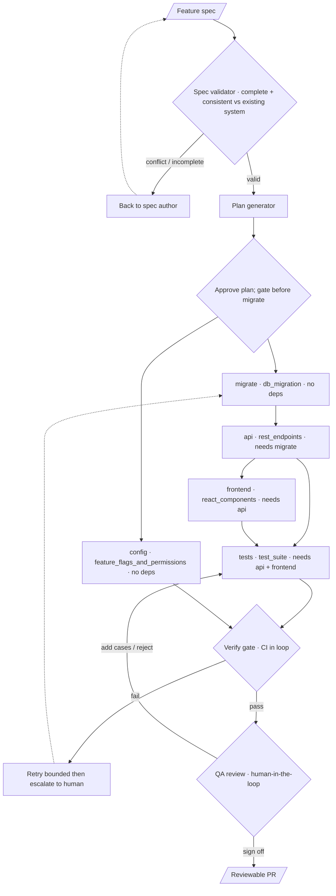

- **Plan generator:** spec → typed task DAG. The only creative planning step; output is structured and human-approved.
- **Conductor:** deterministic DAG executor — walks dependencies, dispatches stages, enforces typed handoff, routes failures. Code, not a model.
- **Typed artifacts between stages:** the frontend stage receives the API-contract artifact, not a prose handoff — the fix for sequential-handoff brittleness.
- **Isolated env per run:** VM/worktree plus isolated DB, cache, and state, so CI runs in the loop and parallel runs never collide.
- **Failure recovery:** per-stage bounded retries, then human escalation, with checkpointing so a single stage re-runs in isolation.
- **Cross-run scoping:** the conductor serializes or merge-queues runs whose write sets overlap, so two concurrent features never land conflicting diffs — env isolation prevents state collision, this prevents source collision.

---

## 5. Harnessed worker

Same model, different jacket. Every DAG stage is one invocation of the shared LLM with a stage-specific harness of context, memory, tools, and skills; output is scored against the spec before it can advance. Skills are the unit of reuse.

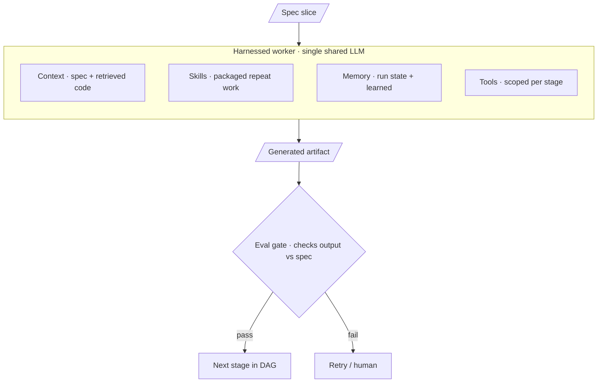

- **Skill library:** packaged, versioned, testable units of recurring work — instructions, exemplars, helper tools, and each skill's own eval. Pattern skills (CRUD anatomy) plus product-convention skills (Vault field, permission gate, table component, audit logging).
- **Shared infrastructure:** skills, harnesses, exemplars, and evals are versioned and reviewed like code, owned centrally — not private per-engineer factories.
- **Scaling:** a new pattern means authoring its skills; a new product means reusing pattern skills plus authoring convention skills. Never rebuilding the system.
- **Context connectors (enablers):** give workers reach into the systems where the 78% lives. Inbound — Linear/Jira/Notion into the spec compiler, so a brief is pulled from where PMs write it (reaching into Requirements & Design, 18%). Outbound — Datadog/incident tool + GitHub into the flywheel, so production incidents and merged-PR comments feed evals and memory. Each connector is a tool, granted or denied per stage and product; regulated repos get a tighter set; secrets and PHI never transit. MCP is the substrate, so adding a source (Slack, PagerDuty, `athena-cli`) is config, not a new subsystem.

---

## 6. Verification (CI in the loop)

Woven in per-stage, with the product's real CI as the source of truth. A defense-in-depth stack: cheap deterministic checks first, then conformance and a non-skippable security floor, then spec-derived tests and real CI, then a risk-weighted human QA gate.

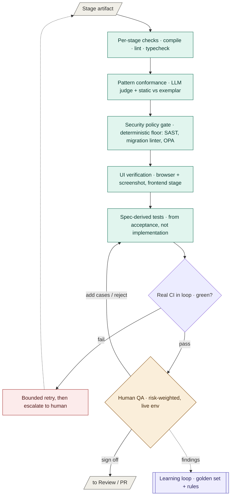

- **Per-stage checks:** compile, lint, typecheck — a stage doesn't complete until its output is syntactically valid and type-safe.
- **Pattern conformance:** LLM judge plus static checks against the retrieved exemplar.
- **Security policy gate:** a deterministic, non-skippable floor (policy code, not the judge) — SAST/semgrep asserting a permission check per endpoint, a migration linter blocking unguarded `DROP`/destructive `ALTER` and requiring a reversible down-migration, an OPA-style engine over the diff. The judge is a second layer, never a substitute; semantic gaps (a permission check on the wrong resource) are caught by a spec-derived test plus mandatory human review on regulated output.
- **UI verification:** browser automation plus screenshot/state inspection for the frontend stage — the pass-rate bottleneck, since UI is harder to verify than backend.
- **Spec-derived tests:** generated from the spec independent of the implementation, so they don't mirror its mistakes.
- **Real CI:** the existing pipeline runs before a PR is emitted. Because CI runs in the loop, "passes CI on first run" needs a precise definition — the v1 metric is the % of features reaching green within the bounded retry budget without escalation; independently, the human's first CI run on the emitted PR should sit near 100%, any gap being an environment-parity bug. The 80% bar is the former; a parity check samples emitted PRs against the product's CI to alarm on drift. This is the single biggest lever on the pass target.
- **Human QA (in the loop):** after automated checks pass, a risk-weighted gate. The reviewer reviews artifacts (test plan, coverage/pass report, UI recordings) and does targeted acceptance testing against a live deployment — lightweight sign-off for low-risk CRUD, mandatory hands-on for regulated/high-blast-radius. Distinct from code review: QA asks "does it behave correctly," the risk router asks "is the code right." The reviewer signs off, adds cases, or rejects to the tests worker; findings become golden-set entries and rules — the highest-signal input to factory improvement.

---

## 7. Review & output

Progressive disclosure with intervention at every stage and a trust ladder that tightens over time. The risk router routes the assembled change by blast radius; high-risk output gets a red-team pass and mandatory human review; the emitted PR carries provenance so the human can meaningfully certify it.

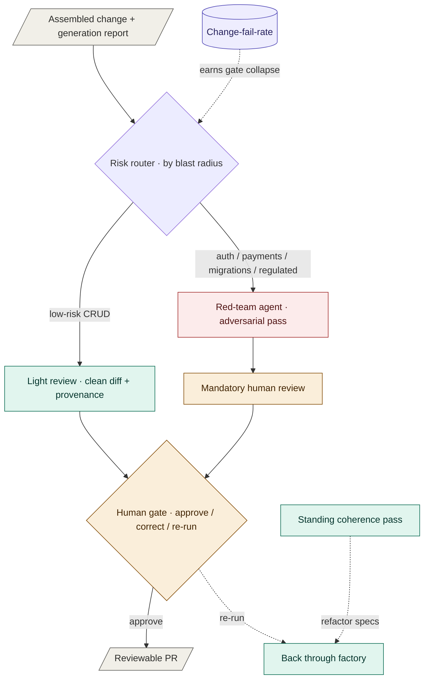

- **Risk router (agentic code owner):** low-risk diffs get light review; auth, payments, migrations, and regulated repos get mandatory human review.
- **Red-team agent:** an adversarial pass before a human engages, for high-risk and regulated output.
- **Review interface:** clean diffs, clear commits, and a generation report with provenance ("matched the Vault-client pattern from billing-service") — what converts a black box into something a senior trusts.
- **Trust ladder:** v1 gates everywhere; as the dashboard proves the pass rate, gates collapse toward plan-approval plus final-PR review. Regulated repos keep a permanent floor.
- **Accountability:** a human gate is accountability only if the human can meaningfully review — hence reviewability by design. The approving engineer is accountable; the platform team owns the machinery, as with any internal CI/CD. The factory shifts what the human certifies from authorship to behavior; it doesn't move liability onto the model.
- **Architectural coherence (human-owned):** per-feature batch discipline risks local-optimum drift over many runs. A standing coherence-pass agent diffs accumulated output against the architectural facts and exemplars, flags divergence and duplication for an architect, and proposes refactor specs that run back through the factory. The factory surfaces drift; the human owns the call.

---

## 8. Learning loop

The flywheel that turns a static pipeline into a self-improving one. Every run is traced and every deploy emits the four DORA outcomes; both feed the evals. Repeated failures become guardrails and skills, accepted work becomes the taste layer, and production failures are the highest-signal feedback — all flowing back to the next run.

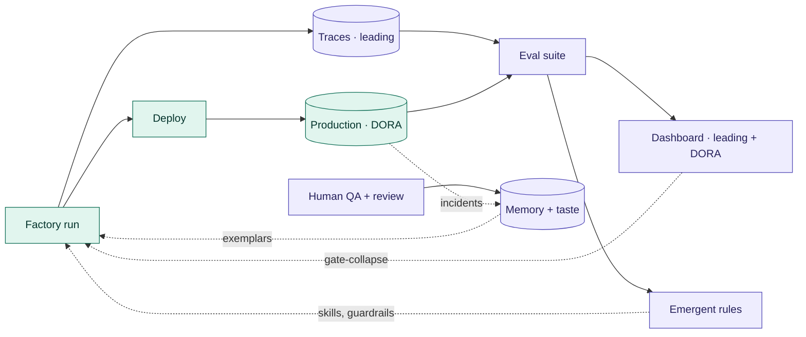

- **Trace store:** structured spans (OpenTelemetry-style) on every tool call, viewable at worker/supervisor/manager levels. Spans decompose lead time per stage, so the factory continuously reproduces the case study's time study (Exhibit A) and shows which stage owns the cycle time.
- **Eval suite:** a curated golden set (known-good specs + PRs) plus harvested traces; deterministic checks for hard criteria, LLM judge for conformance.
- **Dashboard:** leading indicators + DORA outcomes, trended per product and pattern.
- **Emergent rules engine:** repeated failures become guardrails; a recurring correction graduates into a skill. Sits on the hardcoded safety floor.
- **Memory & taste store:** accepted diffs, transcripts, screenshots, and review decisions — sharpens the exemplars retrieval serves.
- **Production signals:** each deployed change emits DORA back into evals and memory; a production failure becomes a golden-set entry and a rule — the loop closing past the PR to production reality.
- **Lifecycle automations:** the factory closes its own loops. Flagship: stale feature-flag cleanup — once a flag is fully rolled out, a fast-lane removal spec runs through the same machinery to delete it and its dead branches. The template for any recurring chore the traces surface (dependency bumps, config drift, log triage).

---

## 9. Skill lifecycle

Skills are the unit of reuse, so creation is a defined workflow, not one-time authoring. A skill is born hand-authored or graduated from traces, passes its own eval set and human review, runs in shadow before going active, and is retired when it underperforms.

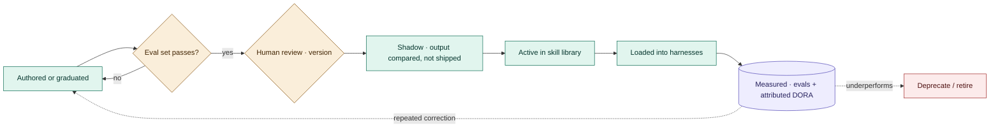

- **Origin:** hand-authored for a known recurring task, or graduated when the emergent-rules engine sees the same correction recur above a threshold.
- **Anatomy:** instructions, exemplars, helper tools, and its own eval set. No eval, no entry.
- **Validation gate:** must pass its eval set against the golden cases before promotion.
- **Review & versioning:** reviewed like code and versioned; product profiles pin a known-good version, so one product can stay stable while others adopt a newer one.
- **Promotion:** candidate → shadow (output compared, not shipped) → active, so it earns trust on real work before gating anything.
- **Regression safety:** changing a skill or swapping the model re-runs its evals; no version ships if scores drop.
- **Measurement & retirement:** each skill carries its eval scores plus attributed lead time and change fail rate; consistent underperformers are retired.
- **Ownership:** shared central infrastructure, never private per-engineer copies.

---

## 10. Eval architecture

Evals are the load-bearing layer: because the brain is a stochastic LLM, evals convert nondeterministic generation into a gated, measurable, improvable system — nothing advances without passing one, and each harness carries its stage's eval as its definition of done. One governed golden set feeds a harness that gates four levels, and the golden set grows from every QA finding and production failure.

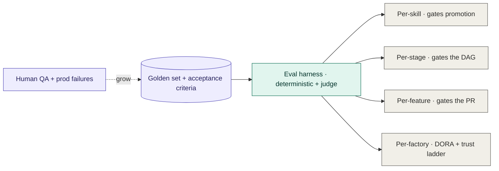

- **Four levels, each a gate:** per-skill (library entry), per-stage (between DAG stages), per-feature (the verify gate — real CI + spec-conformance, the 80% bar), per-factory (dashboard + DORA, gating trust-ladder collapse).
- **Two methods:** deterministic checks for hard criteria (compile, lint, types, CI, security policy, characterization) and an LLM judge for fuzzy criteria (conformance, acceptance satisfaction, "would a senior say a teammate wrote this").
- **Golden set (ground truth):** curated, versioned specs paired with known-good PRs plus each spec's acceptance criteria — shared central infrastructure, grown from every QA finding and production failure.
- **Trusting the judge:** the judge is itself eval'd against human decisions on a held-out set and re-checked when the model changes, so a drifting judge can't silently corrupt the gates.
- **Eval-driven:** the eval is written with the acceptance criteria and each skill, before generation — the factory knows what correct means before it builds.

---

## 11. Legacy change flow — brownfield surgery

When a feature modifies existing code rather than adding fresh, the legacy-hardening layer runs first: impact analysis sizes the blast radius, characterization tests pin current behavior before any change, and a behavior-diff gate separates intended changes from regressions.

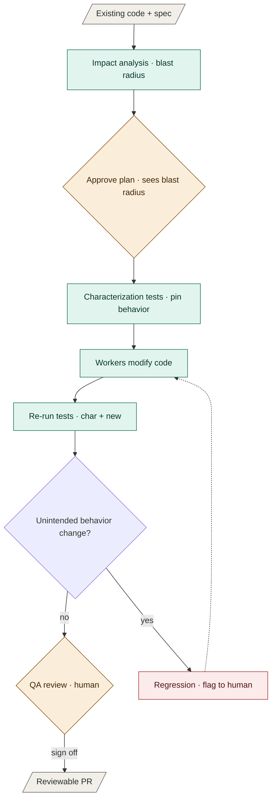

- **Impact analysis:** the structural/dependency index computes the blast radius — every caller and dependent, with dynamic-dispatch and reflection sites flagged uncertain. It attaches to the plan so the human approves with the blast radius in view; the plan adds test targets; the risk router weights the feature up.
- **Characterization tests:** golden-master tests pin current behavior and must pass on unchanged code first. After modification, any failure is a behavior change — intended ones update the test, unintended ones block and escalate. The compensator for legacy's weak coverage; un-characterizable code is escalated, not touched blindly.
- **Curated canonical exemplars:** when extraction finds competing patterns above a variance threshold, a human curator blesses the canonical one; curation is versioned in the product profile.
- **Lower starting trust ladder:** brownfield features start fully gated; collapse depends on characterization-test stability too, and high-coupling/low-coverage areas never auto-collapse.
- **Phase 0 (env reproducibility):** per legacy repo, containerize, seed data, stub dependencies, and get CI runnable in isolation — until a repo is reproducibly runnable, CI-in-the-loop and hands-on QA can't operate, so this precedes generation.

---

## 12. Worked example — Payment Methods, brief to PR

The case study's 3.5-day senior-engineer build, run through the factory. Each stage shows the artifact it hands the next — the typed handoffs that replace prose, the concrete answer to BMAD's brittle sequential handoff.

> **Runnable:** this exact flow is implemented as a working slice in [`poc/`](https://github.com/heilashahidi/athena-software-factory/tree/main/poc). `node poc/run.mjs` produces the PR below with the eval gates and CI actually executing; `--flaky migrate` and `--fail api` demonstrate retry-recovery and a compiles-but-wrong change being caught and escalated. See the [POC README](https://github.com/heilashahidi/athena-software-factory/tree/main/poc#readme).

**Stage 0 — Brief.** The engineer pastes the brief verbatim:

> Add a "Payment Methods" management page to the merchant dashboard. Add, edit, delete, set a default. Each method has a type (credit card, ACH, wire), a label, and credentials stored via Vault. List with sorting and filtering, detail/edit form. Audit log every change. Gate behind `payment_methods:manage`.

**Stage 1 — Spec compiler → formal spec.** Emits the typed spec and derives the `acceptance` block — intent, not entity shape:

```json
{
  "product": "payments-dashboard", "pattern": "crud_ui", "entity": "PaymentMethod",
  "fields": [
    {"name": "type", "kind": "enum", "values": ["credit_card","ach","wire"]},
    {"name": "label", "kind": "string"},
    {"name": "is_default", "kind": "boolean"},
    {"name": "vault_ref", "kind": "string", "sensitive": true}
  ],
  "permissions": "payment_methods:manage", "audit": true, "integrations": ["vault"],
  "ui": {"list": true, "detail": true, "form": true},
  "acceptance": [
    "exactly one method is default per merchant",
    "deleting the default promotes the next method by created_at",
    "every create/update/delete writes an audit entry with actor and before/after",
    "a user without payment_methods:manage receives 403 on every endpoint",
    "vault_ref is stored as a reference only; raw credentials never touch the database or logs"
  ]
}
```

Validator gates here: no acceptance criteria, no plan. **Human gate — approve spec.**

**Stage 2 — Plan generator → DAG.** The only creative planning step; human-approved before anything runs:

```json
{
  "plan_id": "pf-20260315-001",
  "stages": [
    {"id":"migrate","type":"db_migration","depends_on":[],"engine":"postgres"},
    {"id":"api","type":"rest_endpoints","depends_on":["migrate"]},
    {"id":"frontend","type":"react_components","depends_on":["api"]},
    {"id":"tests","type":"test_suite","depends_on":["api","frontend"]},
    {"id":"config","type":"feature_flags_and_permissions","depends_on":[]}
  ],
  "estimated_files": 14, "requires_human_approval_before": ["migrate"]
}
```

**Human gate — approve plan.** `config` runs in parallel with the `migrate → api → frontend` chain.

**Stage 3 — `migrate`.** Retrieves the Postgres exemplar; the unique-default criterion becomes a partial index, not application code:

```sql
CREATE TYPE payment_method_type AS ENUM ('credit_card','ach','wire');
CREATE TABLE payment_methods (
  id          uuid PRIMARY KEY DEFAULT gen_random_uuid(),
  merchant_id uuid NOT NULL REFERENCES merchants(id),
  type        payment_method_type NOT NULL,
  label       text NOT NULL,
  is_default  boolean NOT NULL DEFAULT false,
  vault_ref   text NOT NULL,
  created_at  timestamptz NOT NULL DEFAULT now(),
  updated_at  timestamptz NOT NULL DEFAULT now()
);
CREATE UNIQUE INDEX one_default_per_merchant
  ON payment_methods (merchant_id) WHERE is_default;
```

Gate: applies and rolls back cleanly in the isolated DB; the security gate confirms no destructive operation without a guard → green.

**Stage 4 — `api`.** Consumes the migration; emits endpoints *and* a typed contract artifact — what the frontend stage receives, not a prose handoff:

```yaml
# api-contract.artifact  (handed to frontend + tests)
GET    /payment_methods              -> 200 [PaymentMethod]   perm: payment_methods:manage
POST   /payment_methods              -> 201 PaymentMethod      perm: payment_methods:manage
PATCH  /payment_methods/{id}         -> 200 PaymentMethod      perm: payment_methods:manage
DELETE /payment_methods/{id}         -> 204                    perm: payment_methods:manage
POST   /payment_methods/{id}/default -> 200 PaymentMethod      perm: payment_methods:manage
PaymentMethod: { id, type, label, is_default, vault_ref }     # vault_ref write-only on input
errors: 403 when permission absent
```

The credential is written through the Vault-client skill; only `vault_ref` persists. Gate: typecheck, lint, permission-gate conformance → green.

**Stage 5 — `frontend`.** Consumes `api-contract.artifact`, retrieves the table-component exemplar so the list reads as native:

```tsx
// PaymentMethodsList.tsx  (abbreviated)
const cols: Column<PaymentMethod>[] = [
  { key: "label", header: "Label", sortable: true },
  { key: "type",  header: "Type",  filterable: true },
  { key: "is_default", header: "Default", render: r => r.is_default ? <Badge>Default</Badge> : null },
];
export function PaymentMethodsList() {
  const { data } = usePaymentMethods();              // typed from the contract artifact
  return <DataTable columns={cols} rows={data} onRowClick={openDetail} />;
}
```

Gate: typecheck, lint, and UI verification (browser renders the list, asserts sort/filter and the default badge against a screenshot) → green. The pass-rate bottleneck, so its gate is the strictest.

**Stage 6 — `tests`.** Generated from the `acceptance` block, independent of the implementation:

```ts
test("deleting the default promotes the next method by created_at", async () => {
  const [a, b] = await seedMethods({ defaults: ["a"] });   // a is default, created first
  await api.delete(a.id);
  expect((await api.get(b.id)).is_default).toBe(true);
});
test("non-permitted user gets 403", async () => {
  await expect(apiAs(noPerm).list()).rejects.toMatchObject({ status: 403 });
});
```

**Stage 7 — `config` (parallel).** Registers the flag and permission:

```yaml
flag: payment_methods_management        # ships dark, flipped per environment
permission: payment_methods:manage -> roles: [merchant_admin, finance_ops]
```

**Stage 8 — Verify gate.** Real CI (unit + integration) runs in the isolated environment; the security gate and spec-conformance judge run alongside. All green → the PR assembles. (See §6 Verification for what "first-run pass" precisely means in-loop.)

**Stage 9 — QA review (human gate).** The reviewer gets the test plan, the coverage/pass report, the UI recording, and a live clickable deployment — not the diff to re-run. They confirm the five acceptance criteria by hand and sign off; any case they add becomes a golden-set entry.

**Stage 10 — Risk router → PR.** Payments is regulated and money-touching, so the router forces mandatory human review and runs the red-team pass first. The PR carries a provenance report:

> 14 files. Matched the Vault-client pattern from `billing-service`, the table component from `merchant-dashboard/ui`, and the audit-logging mixin from `payments-core`. Unique-default enforced at the DB via partial index. Spec `pf-20260315-001`; every file links to its spec field.

**Human gate — approve, correct, or re-run.** What took 3.5 days — most of it looking up how Athena does Vault, permissions, audit, and table conventions — arrives as a reviewable PR; the engineer's time moves from building to specifying and reviewing.

---

## Reference

### Performance metrics — leading indicators and DORA outcomes

DORA (DevOps Research and Assessment, popularized in *Accelerate*) identified four metrics that distinguish high-performing delivery orgs, in two pairs: throughput (delivery lead time, deployment frequency) and stability (mean time to restore, change fail rate). High performers score well on both at once, and these are delivery-*system* outcomes, never individual measures.

DORA is the factory's north star — the case study's stuck +11% cycle time is a delivery-lead-time result, so DORA is the scoreboard the factory is built to move. It defines success (throughput proves the productivity gain, stability keeps it honest), bridges internal to business (leading indicators predict DORA), closes the loop (deployed changes emit DORA back), and governs autonomy (change fail rate gates how far the trust ladder collapses).

Measure at two levels, and don't confuse them:
- **Leading (fast, internal, per skill/stage):** first-run CI pass rate, human-cleanup time (the PRD's ≤30-minute line), pattern conformance, characterization stability, per-skill eval scores. Diagnostic and fixable — they tell you which skill to improve. Since every agent is the same brain, all variation lives here.
- **Lagging — the DORA four,** at the delivery-system and per-product level, never per agent. What the CTO actually judges the factory on.

The four, mapped to the factory:
- **Delivery lead time:** approved spec → deployable PR → production. The headline target. The conductor parallelizes independent stages and per-stage spans attribute cycle time to the slowest stage. Split variable design (spec authoring) from predictable delivery (generation to PR).
- **Deployment frequency:** a batch-size proxy; one spec is one small batch, pushing frequency up. Enforced upstream by the compiler's batch discipline and downstream by feature flags that ship dark.
- **Mean time to restore:** the deterministic restore path is the feature-flag kill switch plus revert — never asking the generator to fix what it broke; provenance and the audit trail speed diagnosis. A generated fix runs a prioritized lane through the *same* gates, never a gate-skipping one.
- **Change fail rate:** % of factory changes that degrade production or need a rollback. The true correctness metric, distinct from CI pass rate — code can pass CI and still fail in production. This, not CI pass rate, gates trust-ladder collapse and weights the risk router; a canary watches a traffic slice and auto-rolls-back on a spike; each failure is attributed to the producing skill.

Anti-gaming guardrails from the source: **global outcome, not local** (never pit squads or agents against each other); **outcomes, not output** (don't optimize for PR volume, or the factory ships more, smaller, riskier changes).

Sequencing & attribution: first-run CI pass rate is the v1 gate and a per-skill diagnostic; change fail rate is the lagging outcome autonomy is judged against. Portfolio DORA is confounded by everything else shipping, so v1 is proven on directly-attributable leading indicators plus a matched cohort — factory- vs hand-built CRUD, same product and sprint, against a pilot-product baseline hold. DORA is the program's north star, not the v1 scoreboard.

### Cost and ROI

A CRUD feature is ~3.5 senior-engineer-days, roughly $3–4K loaded. The factory's token spend per feature — generation, bounded retries, eval and judge passes — is tens of dollars, two orders of magnitude below the labor it displaces, so tokens are not the constraint. The costs that matter are the human's spec-and-review time and the platform's amortized build (3 engineers × 60 days, ~$150–200K). ROI is dominated by how much review time the trust ladder removes, not inference cost. Break-even is the build cost over labor saved per feature times CRUD volume — at 38% of features across a 23-deploy/day portfolio, payback is in months. Change fail rate gating trust-ladder collapse keeps this honest: the factory can't book ROI by shipping fast-but-broken.

### Security and compliance

- **Secrets and PHI never persist:** a secrets scanner (gitleaks-style) and a PHI classifier run at every ingestion boundary (indexer, trace store, memory) and redact before anything persists; the factory handles Vault references only. Test fixtures with real secrets are the live risk, so the scrub runs on ingest, upstream of any worker.
- **Prompt-injection boundary:** retrieved exemplars and inbound briefs are data, not instructions — delimited as untrusted context, never executed. The compiler validates every brief into the typed schema, so free text must fit a field — the schema is the injection firewall. Indexed content enters only via the re-index-on-merge hook, so a crafted comment must clear human PR review first.
- **Stricter regulated harness:** tighter tool scope, mandatory security stage, no learned-memory persistence from those repos.
- **Auditability maps to named controls:** every change traces to an approved spec and a named approver; spec author ≠ approver is segregation of duties. Satisfies SOC 2 CC8.1 (change management) and HIPAA §164.312(b) (audit controls) on an append-only, tamper-evident trace store. The generation report plus the trace is the change record — automatically complete and reproducible because the conductor is deterministic.

---

## v1 scope (60 days, 3 engineers, CRUD + UI, 2 products)

Build:

| v1 deliverable | Scope |
|---|---|
| Conductor + harness runtime | One deterministic DAG executor and one reusable worker harness |
| Indexer + exemplar extraction | Two pilot products only |
| Spec schema + compiler | Brief-to-spec compilation, the validator, and the `acceptance` block |
| CRUD pattern skills | Migration (per engine), REST endpoints, table component, permission gate, audit logging, Vault field — hand-authored into the shared registry, each with its own eval, promoted via shadow |
| CI-in-the-loop verification | Per-stage checks plus the product's real CI in the isolated environment |
| Mandatory human QA | Every v1 feature: test-plan/report review plus hands-on testing; flagged cases feed the golden set |
| Evals | Per-stage and per-feature, golden set of 10–15 known-good specs |
| Review UI | Stage-level approval and intervention |

Defer to later phases:

| Deferred | Rationale |
|---|---|
| Automatic skill graduation from traces | v1 hand-authors skills; the emergent-rules-to-skill loop needs trace volume v1 won't have yet |
| Full per-skill eval coverage | Per-stage and per-feature evals carry the 80% bar; per-skill depth pays off once the library is larger |
| Mature factory-level dashboard | Needs accumulated DORA history to be meaningful; leading indicators suffice for v1 |
| Risk-based collapse of the QA and code-review gates | Collapse must be earned against production change-fail-rate, which v1 hasn't generated |
| Integration, Workflow, Analytics patterns | Each is new skill authoring on the same machine; prove CRUD first |

Every node in the master diagram has a slot for these without redrawing the architecture.

If the pilot products are genuinely legacy rather than clean brownfield, Phase 0 — making each repo reproducibly runnable — precedes generation, and impact analysis, characterization tests, and curated exemplars join from day one with the trust ladder starting fully gated. Budget for Phase 0 explicitly: standing up a stubborn legacy environment can eat as much of the 60 days as building the factory itself, so pick the two most tractable repos for v1 and defer the gnarliest. Concretely: weeks 1–2 are a Phase-0 spike on both pilot repos with a hard go/no-go — a repo that can't be made reproducibly runnable in two weeks is swapped or v1 drops to one product, and v1 success is defined on whatever clears the gate. The regulated, high-blast-radius repo is Phase 2, after the hardening layer has earned trust.
